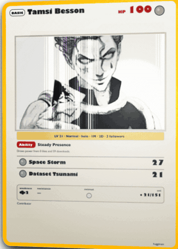

# HuggiMon

Generate your **AI Trainer Card** from your Hugging Face profile. Turn your Hub activity into a collectible, shareable card inspired by Pokémon TCG culture.

Built with **Next.js** and deployed on [Vercel](https://vercel.com).



## Credits

HuggiMon builds on two open-source projects:

- **[pokemon-cards-css](https://github.com/simeydotme/pokemon-cards-css)** — Pokémon TCG holo effects (3D tilt, glare, rarity shaders). The full stylesheet stack is vendored under `web/public/pokemon-cards-css/`, with a React port of `Card.svelte` via `@react-spring/web`.
- **[gitfut](https://github.com/younesfdj/gitfut)** — The idea of turning a developer profile into a shareable collectible card (`/{username}` URLs, README embed snippets, stat-to-card mapping). HuggiMon applies that pattern to Hugging Face activity instead of GitHub.

Thank you to [simeydotme](https://github.com/simeydotme) and [younesfdj](https://github.com/younesfdj) for the foundations.

## How it works

1. Open a profile at `/{username}` (e.g. `/ImTamsi`).
2. HuggiMon fetches public models, datasets, spaces, followers and activity from the Hugging Face API.
3. It computes stats, type, rarity, level, attacks and evolution path.
4. You get an animated Pokémon-TCG-style card — 3D tilt, glare, holo by level tier — plus a PNG face to download and share.

## Follower binder

Your followers fill a 3×3 card binder: browse page by page with a physical spread animation (two plastic sleeves, sheet flip around the spine). Each follower appears as a mini trainer card with level, stars and energies. Likes on your work become energies on your card.

Click any follower mini-card to pull it out and inspect it enlarged over a dark backdrop.

## Develop

```bash
cd web
npm install
npm run dev
```

Open http://localhost:3000 — try `/ImTamsi`, `/lysandre`, `/lhoestq`.

## Deploy on Vercel

1. Import the repo and set **Root Directory** to `web`.
2. Deploy — no env vars required (public HF API).

## Share your card

Your public profile lives at:

```
https://your-domain.vercel.app/ImTamsi
```

Add this snippet to your GitHub or Hugging Face README (replace host and username):

```markdown
[](https://your-domain.vercel.app/ImTamsi)
```

## API endpoints

| Route | Description |
|-------|-------------|
| `GET /{username}` | Public trainer profile (card + binder + share) |
| `GET /api/card/{username}` | JSON card metadata (including `energy`) |
| `GET /api/card/{username}/face` | Composed 660×921 PNG face |
| `GET /api/binder/{username}` | JSON binder page of follower mini-cards (`?page=` optional) |

## Card stats

| Stat | Meaning |
|------|---------|
| MODEL | Models published + likes + downloads |
| DATA | Datasets published |
| SPACE | Spaces published + likes |
| IMPACT | Total likes + downloads across public work |
| COMMUNITY | Followers + discussions |
| DOCS | Documentation quality (model/dataset cards with descriptions) |

Each card carries an **energy**: type from card type, count from total likes (`energy.name`, `energy.symbol`, `energy.count` in the JSON API).

## Types & rarity

**Types:** `Code`, `Vision`, `Audio`, `NLP`, `Multimodal`, `Dataset`, `Agent`

**Rarity:** `Common`, `Rare`, `Epic`, `Legendary`

## Architecture

| Path | Role |
|------|------|
| `web/src/components/PokemonCard.tsx` | Interactive holo card |
| `web/src/components/HuggimonBinder.tsx` | Open-spread binder UI |
| `web/src/lib/card-variant.ts` | 14 holo tiers from HF level |
| `web/src/lib/scoring.ts` | Stats, level, attacks from HF repos |
| `web/src/lib/hf-fetcher.ts` | Hugging Face REST API |
| `web/public/pokemon-cards-css/` | Vendored CSS + assets |

See [web/README.md](web/README.md) for face composition and holo tier details.

## License

MIT
